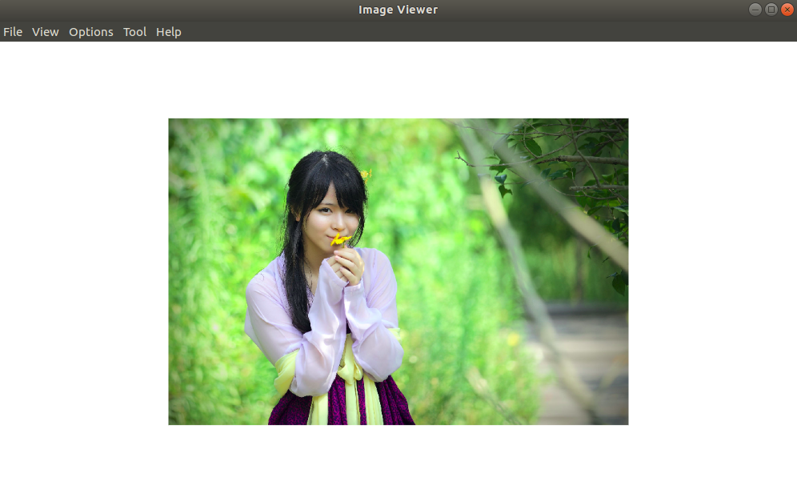

# image-viewer

An image viewer electron application based on React, React Router.

## preview





## related

- [electron-react-boilerplate](https://github.com/chentsulin/electron-react-boilerplate)
- [diaporama](https://github.com/gre/diaporama)
- [ant-design](https://github.com/ant-design/ant-design)
- [react-medium-image-zoom](https://github.com/rpearce/react-medium-image-zoom)

## development

```
# clone repository
git clone https://github.com/senntyou/image-viewer.git

# install dependencies
npm install

# dev
npm run dev

# run in production mode
npm run start

# create installer

npm run package-all # create installer for linux&win&mac.

npm run package-linux # create installer only for linux.

npm run package-win # create installer only for win.

npm run package-mac # create installer only for mac.
```
